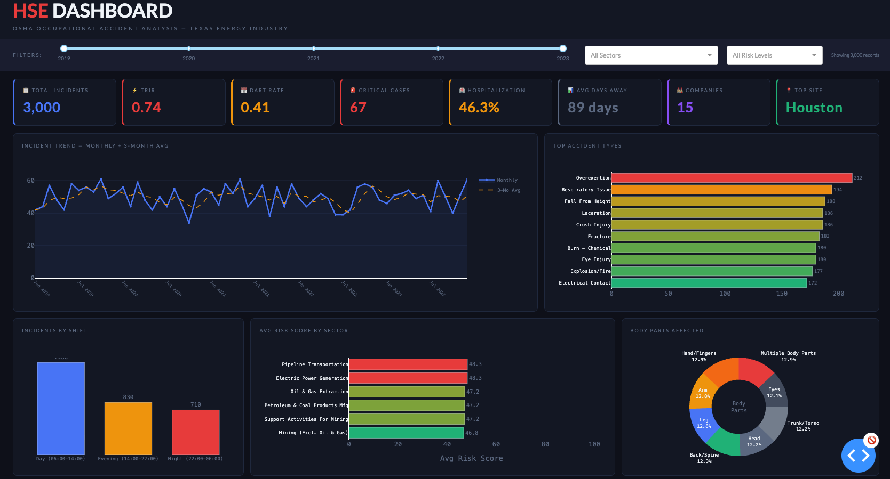

# HSE Dashboard — OSHA Incident Analysis & Risk Intelligence
### Texas Energy Industry | Oil & Gas | Petrochemical | Construction

[](https://python.org)
[](https://pandas.pydata.org)
[](https://dash.plotly.com)
[](LICENSE)
[]()



---

## What This Is — And Why It Matters

Most HSE teams track incidents in spreadsheets. Reports are produced manually, KPIs are calculated once a month, and by the time leadership sees a trend, it's already a pattern of harm.

This dashboard was built to solve that gap — pulling OSHA severe injury data for the Texas energy sector and turning it into **operational HSE intelligence that field leaders and EHS managers can actually use.**

Built by an EHS professional with 9 years of field experience in oil & gas and industrial operations — not a data scientist who learned about safety from a textbook.

---

## What It Answers — In HSE Terms

| Business Question | What the Dashboard Shows |
|---|---|
| Where are our highest-risk exposures? | Geographic incident heat map by site and county |
| Which sectors and NAICS codes drive incidents? | Sector risk ranking with incident frequency and severity |
| Is our TRIR trending up or down? | Monthly TRIR trend with 12-month rolling average |
| Are we catching problems before they become incidents? | Leading vs. lagging indicator ratio (near-miss proxy) |
| Which incident types repeat most? | Classification breakdown — struck-by, caught-in, fall, amputation, etc. |
| How severe are our incidents when they occur? | DART rate, hospitalization rate, and composite risk score (0–100) |

---

## HSE KPIs Tracked

| KPI | Definition | Why It Matters |
|-----|-----------|----------------|
| **TRIR** | Total Recordable Incident Rate per 100 FTEs | OSHA standard — required for contractor prequalification (ISNetworld, Avetta, PEC) |
| **DART Rate** | Days Away, Restricted & Transfer per 100 FTEs | Measures severity of recordable incidents |
| **Hospitalization Rate** | % of incidents requiring inpatient admission | Indicator of life-altering severity |
| **Risk Score** | Composite 0–100 per incident (severity × frequency) | Enables prioritization of corrective actions |
| **Critical Cases** | Incidents with Risk Score ≥ 75 | High-priority cases requiring immediate CAPA |
| **Leading Indicator Ratio** | Near-miss proxy vs. recordable rate | Measures proactive safety culture health |

---

## Data Source

- **OSHA Severe Injury Reports** — [osha.gov/severeinjury](https://www.osha.gov/severeinjury)
- NAICS codes: **211, 213, 221, 324, 486** — Texas oil & gas, pipeline, refining, utilities
- Coverage: **2019–2023** — pre/post COVID operational comparison included
- Scope: Texas energy corridor — Houston MSA, Permian Basin, Gulf Coast

---

## Project Structure

```
hse-dashboard-texas/
├── src/
│   ├── schema.py          # Column definitions and data types
│   ├── load_data.py       # OSHA data pipeline + normalization
│   ├── clean_data.py      # Cleaning pipeline + risk score calculation
│   ├── analysis.py        # TRIR, DART, and KPI computation functions
│   ├── export_excel.py    # 6-sheet Excel report with charts
│   └── export_pptx.py     # 8-slide executive PowerPoint for leadership
├── dashboard/
│   ├── app.py             # Plotly Dash interactive dashboard
│   └── index.html         # Static HTML preview
├── assets/
│   └── screenshots/       # Dashboard preview images
├── notebooks/             # Exploratory analysis and methodology notes
└── requirements.txt
```

---

## How to Run

```bash
# 1. Clone the repository
git clone https://github.com/WilliamBaronData/hse-dashboard-texas.git
cd hse-dashboard-texas

# 2. Create virtual environment
python3 -m venv venv
source venv/bin/activate        # Windows: venv\Scripts\activate

# 3. Install dependencies
pip install -r requirements.txt

# 4. Run data pipeline
python src/load_data.py
python src/clean_data.py

# 5. Launch interactive dashboard
python dashboard/app.py
# Open browser: http://127.0.0.1:8050

# 6. Generate static reports (optional)
python src/export_excel.py      # Produces 6-sheet Excel workbook
python src/export_pptx.py       # Produces 8-slide executive PowerPoint

**Note:** Add your Mapbox token in `dashboard/app.py`:
`MAPBOX_TOKEN = "your_token_here"`
Get a free token at https://account.mapbox.com
```

---

## Built For Real HSE Operations

This tool reflects how EHS performance data is actually used in the field:

- **Executive reports** generated automatically — no manual formatting
- **CAPA tracking** integrated into risk scoring — highest-risk items surface first
- **Contractor prequalification context** — TRIR benchmarked against ISNetworld thresholds
- **Regulatory alignment** — KPIs mapped to OSHA 300/300A recordkeeping requirements
- **Multi-site scalability** — designed for operations with multiple locations or contractors

---

## Tech Stack

| Tool | Purpose |
|------|---------|
| Python 3.10+ | Core language |
| Pandas | Data pipeline and manipulation |
| Plotly Dash | Interactive web dashboard |
| OpenPyXL | Excel report generation |
| python-pptx | Executive PowerPoint output |

---

## About the Author

**William Baron** — EHS Professional | Houston, TX

9 years of field experience in oil & gas, hydrocarbons, petrochemical, manufacturing, and construction operations. Master's degree in Artificial Intelligence. This portfolio bridges operational HSE knowledge with data analytics to build tools that support real safety decisions — not academic exercises.

📧 hsebaron@gmail.com
🔗 [linkedin.com/in/william-baron-ehs](https://linkedin.com/in/william-baron-ehs)
🗂️ Full portfolio: [github.com/WilliamBaronData](https://github.com/WilliamBaronData)

---

## Portfolio Projects

| # | Project | Description |
|---|---------|-------------|
| **1** | **hse-dashboard-texas** ← *you are here* | OSHA incident analysis dashboard — Texas energy sector |
| 2 | environmental-compliance-hub | EPA Tier II, TRI, RCRA, RMP compliance tracking — Houston MSA |
| 3 | air-quality-houston | AQI monitoring + ML risk prediction model |
| 4 | real-time-hse-monitor | Live occupational health monitoring with sensor data pipeline |
| 5 | electrical-safety-hub | Electrical safety management — NFPA 70E + OSHA 1910.147 |

---

*© 2026 William Baron. Shared for portfolio purposes. Commercial use prohibited without written permission.*
---
*Project 1 of 6 — HSE Data Science Portfolio*
*Next: Geospatial Air Quality Analysis + ML Risk Prediction*
